<!--
---
slug: "tryhackme-carnage"
title: "TryHackMe — Carnage"
date: "2026-07-23"
ctf: "TryHackMe"
challenge: "Carnage"
tags: ["wireshark"]
tools: ["Wireshark"]
summary: "Using Wireshark to analyze malicious network traffic"
---
-->

## Overview

| Field | Detail |
|-------|--------|
| CTF | TryHackMe |
| Category | Networking |
| Tools | Wireshark |

---

## Questions

### What was the date and time for the first HTTP connection to the malicious IP? (answer format: yyyy-mm-dd hh:mm:ss)

I started by changing the time format from `Seconds Since Beginning of Capture` to the specified format of `Date and Time of Day` using `View` -> `Time Display Format`. I then used a Display Filter to display only `http` packets. Now, sorting packets by time, I was able to find the first HTTP connection occured at ***2021-09-24 16:44:38***.

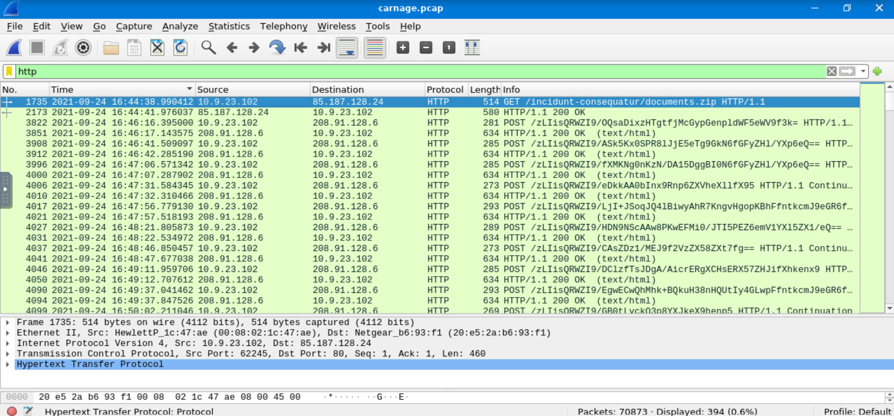

---

### What is the name of the zip file that was downloaded?

In the packet list screen shown above, we can see the zip file requested is named ***documents.zip***.

---

### What was the domain hosting the malicious zip file?

In the packet details page for this packet, under the Hyptertext Transfer Protocol subtree, we can see the host is ***attirenepal.com***.

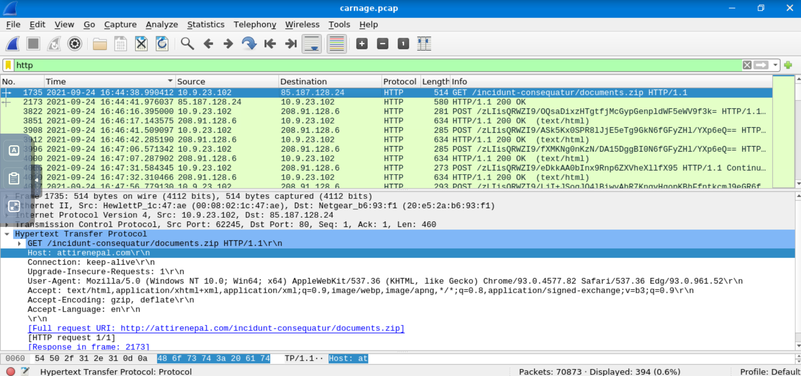

---

### Without downloading the file, what is the name of the file in the zip file?

Selecting the response packet to the GET request for the zip file, I right-clicked on the `Data` field under the Data subtree and selected `Show Packet Bytes...`. This created a popup with mostly unintelligible bytes, however the first line contained a file name: ***chart-1530076591.xls***.

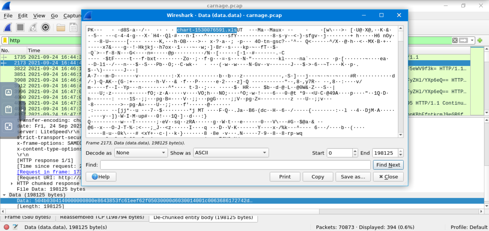

---

### What is the name of the webserver of the malicious IP from which the zip file was downloaded?

In this same packet, I went to the Hypertext Transfer Protocol subtree to find the server is ***LiteSpeed***.

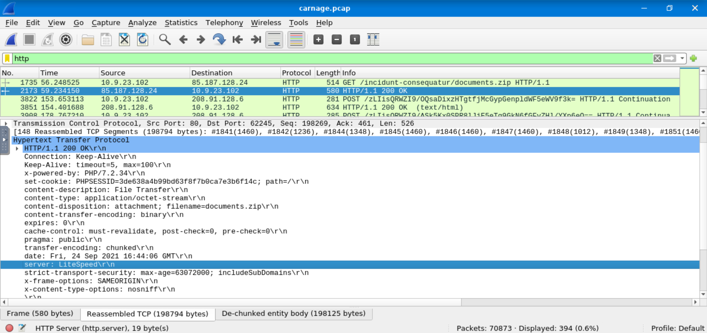

---

### What is the version of the webserver from the previous question?

In this same packet and subtree, the `x-powered-by` value shows the webserver version: ***PHP/7.2.34***.

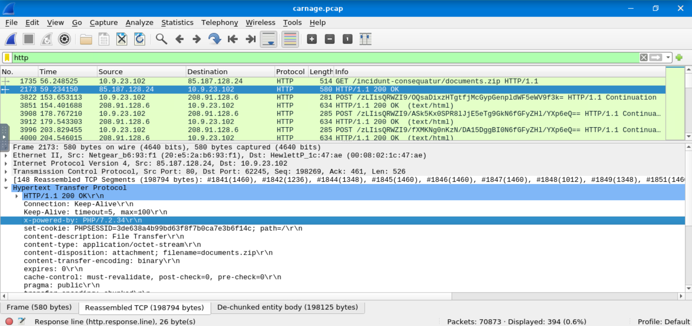

---

### Malicious files were downloaded to the victim host from multiple domains. What were the three domains involved with this activity?

Downloads occurred over HTTPS on port 443. Hence, to visualize the connection between DNS requests and these downloads, I used the Display Filter to filter DNS queries and downloads using the filter `tcp.port == 443 || dns`. This shows the DNS queries alongside downloads. Parsing through these filtered results, I found multiple DNS queries followed downloads from seemingly legitimate domains such as microsoft.com, skype.com, and microsoftonline.com. While just because these are legitimate-looking domains does not mean they are not malicious (due to DNS poisoning or other situations), I skipped over these on my first take in an attempt to find domains that were less legitimate-looking. 

Scrolling down to the timestamp of 16:45:11, I found the domain of ***finejewels.com.au*** followed by a download. This is not a recognizable domain, and combined with it being an international domain, I added it to my list of suspicious domains.

Scrolling further to the timestamp of 16:45:20, I found the domain of ***thietbiagt.com*** folllowed by a download. Similarly, this was not a recognizable domain, so I added it to my list.

Scrolling on to the timestamp of 16:45:25, I found the domain of ***new.americold.com*** followed by a download. This is also not a recognizable domain, causing me to add it to my list.

The combination of these domains proved to be the correct answer in TryHackMe.

---

### Which certificate authority issued the SSL certificate to the first domain from the previous question?

Going back to the DNS request at 16:45:11, I scrolled down 9 packets to the packet labeled `Certificate, Server Key Exchange, Server Hello Done`. This packet contains the verification of the server's certificate. In the packet's first Transport Layer Security subtree I found the authority organization's name to be ***GoDaddy***.

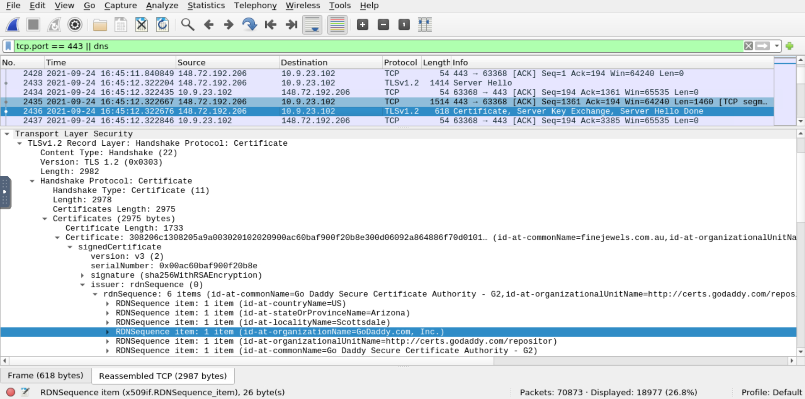

---

### What are the two IP addresses of the Cobalt Strike servers? Use VirusTotal (the Community tab) to confirm if IPs are identified as Cobalt Strike C2 servers. (answer format: enter the IP addresses in sequential order)

After doing some research into Cobalt Strike C2 servers, I learned one way to identify them is by identifying IP addresses with relatively large amounts of communication with victim computer. To find these IP addresses, I used the top-bar menu option Statistics -> Conversation, and sorted based on `Bytes B -> A` as this would show the IP addresses sending the most data to the victim computer.

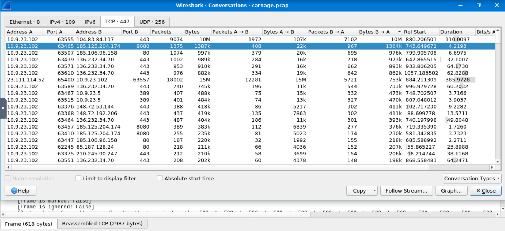

I then went through this list of IP addresses and looked them up in [Virus Total](https://www.virustotal.com/). Going through both the Detection and Community pages of Virus Total, I was able to identify ***185.106.96.158*** and ***185.125.204.174*** as the C2 servers.

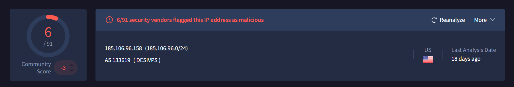
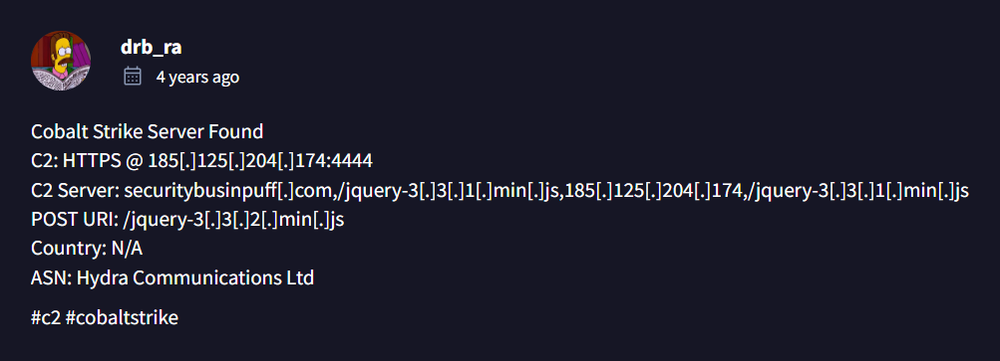

---

### What is the Host header for the first Cobalt Strike IP address from the previous question?

The first IP above is `185.106.96.158`. I started by setting a display filter as `ip.addr==185.106.96.158`. From here, I was able to see packet 6326 is an HTTP packet. The Hypertext Transfer Protocol subtree of this packet shows the host as ***ocsp.verisign.com***.

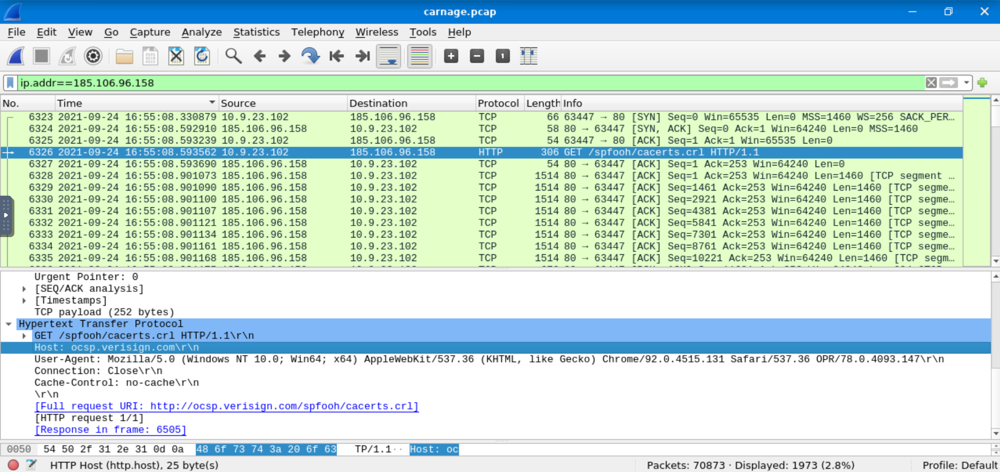

---

### What is the domain name for the first IP address of the Cobalt Strike server? You may use VirusTotal to confirm if it's the Cobalt Strike server (check the Community tab).

As shown in the image above, the first communication with `185.106.96.158` occurred at 16:55:08. Using this information, I set a display filter to show only DNS queries. I then scrolled to this timestamp, and found a DNS query occuring two seconds after this first connection showing the domain as ***survmeter.live***.

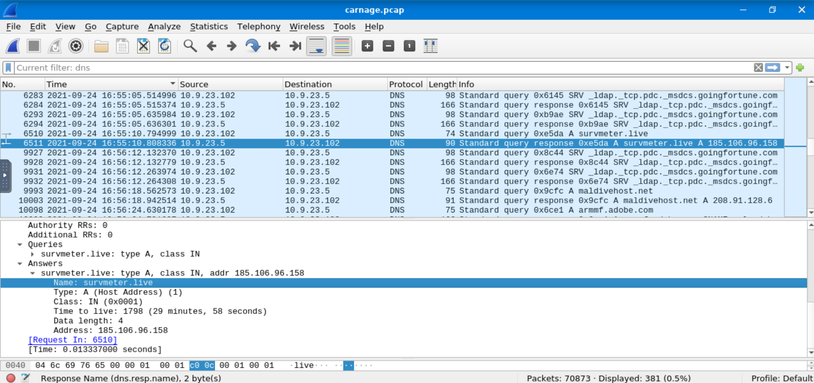

---

### What is the domain name of the second Cobalt Strike server IP?  You may use VirusTotal to confirm if it's the Cobalt Strike server (check the Community tab).

Using the same methodology as the question above, I set a display filter to only show the second C2 server's ip: `ip.addr==185.125.204.174`. After sorting by time, I found the first communication with this server occured at 16:53:24. I then set a display filter to display only DNS queries, and found a query four seconds after this first connection showing the domain as ***securitybusinpuff.com***.

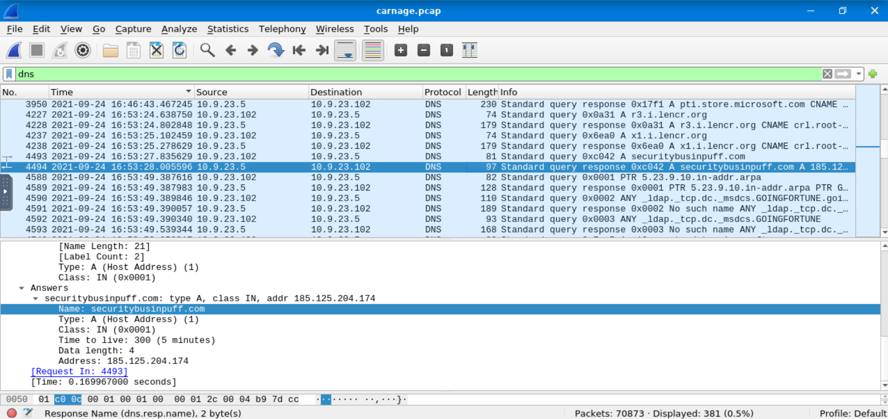

---

### What is the domain name of the post-infection traffic?

To approach this question, I decided to parse through the DNS queries following the queries for the two C2 servers as described above to search for suspicious domains. A little more than a minute after the DNS query for survmeter.live, there was a DNS query for `maldivehost.net`. 

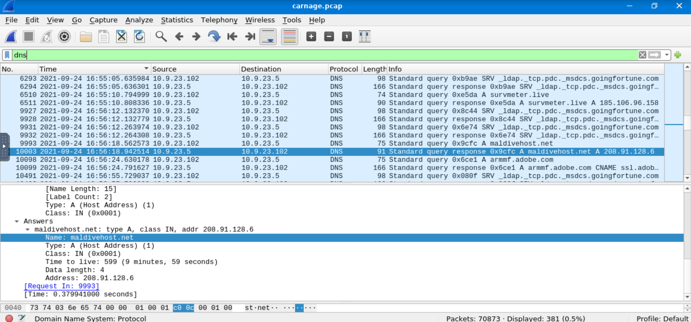

This domain was linked with the IP address `208.91.128.6`. I then removed the display filter to investigate the communication with this server. It showed many TCP and HTTP packets following the infection from the C2 servers. This made me confident that the answer was ***maldivehost.net***.

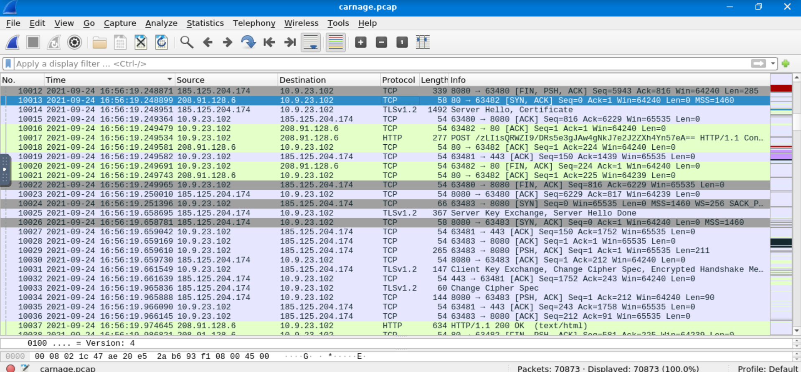

---

### What are the first eleven characters that the victim host sends out to the malicious domain involved in the post-infection traffic? 

Looking at the packets sent between maldivehost.net and the victim following the DNS query, I found an HTTP packet sent from the victim to the malicious domain. This POST request contained the first 11 characters ***zLIisQRWZI9***.

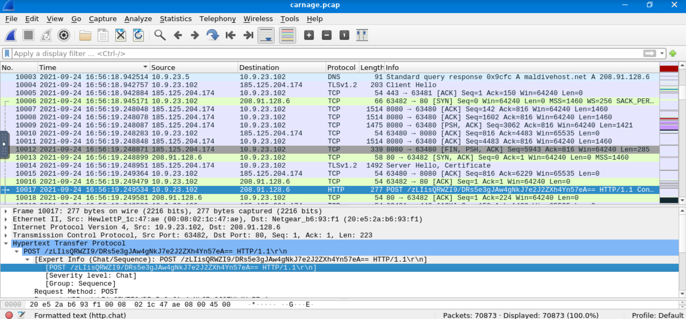

---

### What was the length for the first packet sent out to the C2 server?

I first set a display filter for the malicious server: `ip.addr==208.91.128.6`. I then sorted by time and found the first HTTP packet sent from the victim to this server. This packet has a length of ***281***.

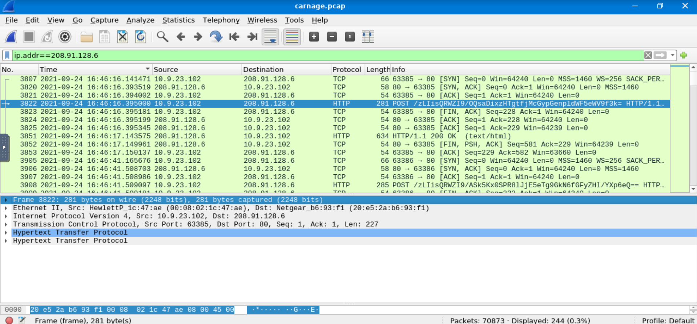

---

### What was the Server header for the malicious domain from the previous question?

A few packets after the POST request from the previous question is the HTTP response to the POST request. The server header included in this response is ***Apache/2.4.49 (cPanel) OpenSSL/1.1.1l mod_bwlimited/1.4***.

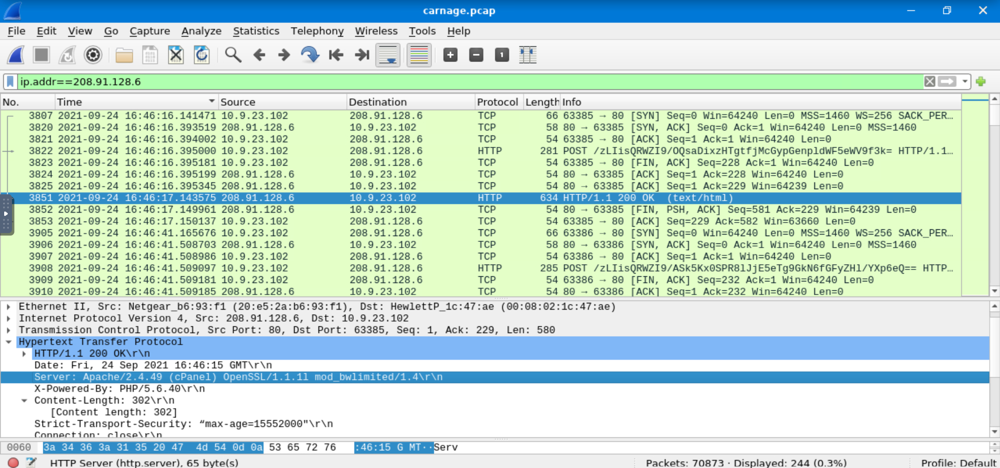

---

### The malware used an API to check for the IP address of the victim’s machine. What was the date and time when the DNS query for the IP check domain occurred? (answer format: yyyy-mm-dd hh:mm:ss UTC)

To find this query, I used a display filter to show only DNS queries. I then searched the Packet List for "api" using ctrl+f. There was a request for `api.msn.com` in packet 990. However, this is before the infection occurred. Hence, I went on to the next result, a request for api.ipify.org in packet 24147, after the infection, which occured at ***2021-09-24 17:00:04***.

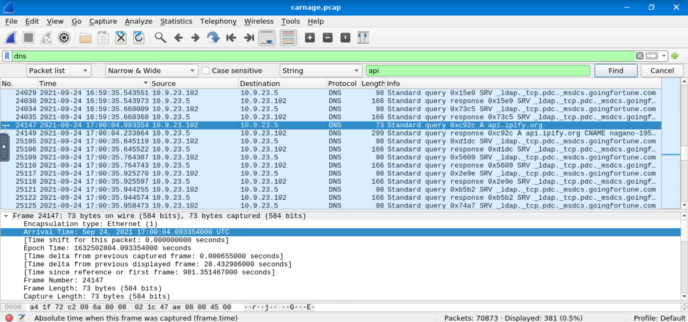

---

### What was the domain in the DNS query from the previous question?

As shown above, the domain for this api is ***api.ipify.org***.

---

### Looks like there was some malicious spam (malspam) activity going on. What was the first MAIL FROM address observed in the traffic?

To find this address, I cleared the display filters to display all packets, and search the packet list for "MAIL FROM" using ctrl+f. I then sorted by time and found the first packet in the search results. This MAIL FROM address is ***farshin@mailfa.com***.

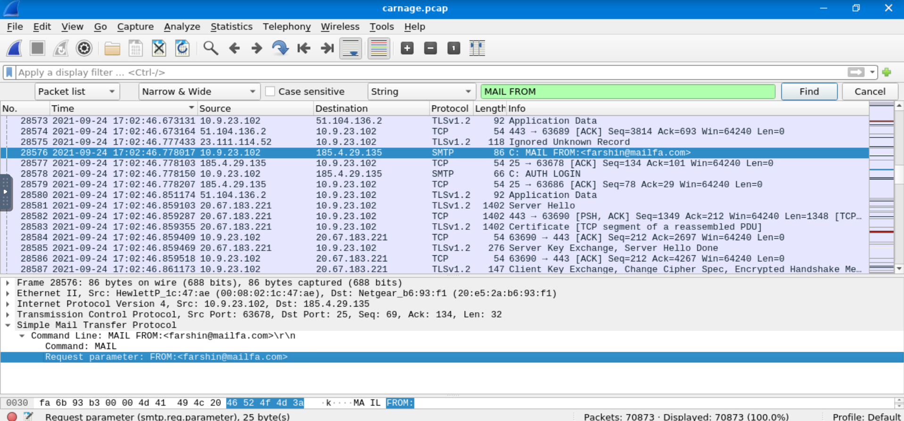

---

### How many packets were observed for the SMTP traffic?

To find the total number of SMTP packets, I set a display filter for smtp and observed the total number of displayed packets in the bottom-right corner as ***1439***.

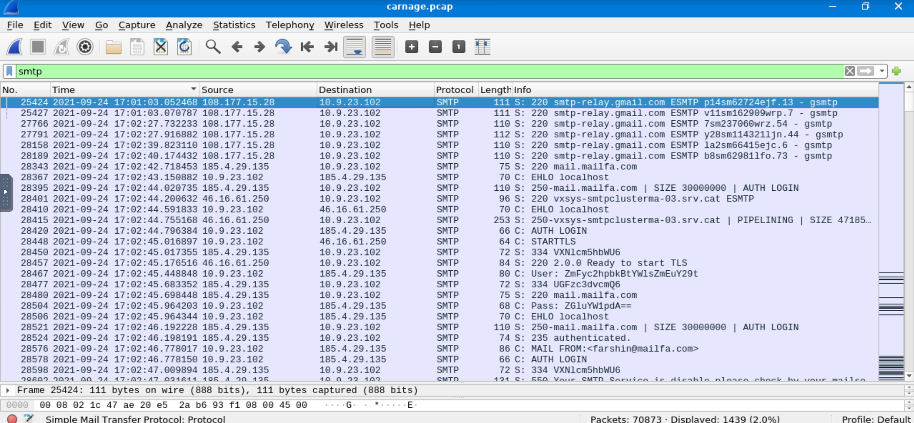

---