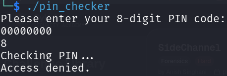
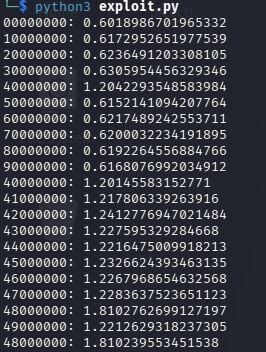

<!--
---
slug: "picoctf-SideChannel"
title: "picoCTF — SideChannel"
date: "2026-08-26"
ctf: "picoCTF"
challenge: "SideChannel"
difficulty: "beginner"
tools: ["Python"]
summary: "Exploiting time-based vulnerability in PIN authenticator"
---
-->

# picoCTF — SideChannel

## Overview

| Field | Detail |
|-------|--------|
| CTF | picoCTF |
| Category | General Skills |
| Tools | Python |

---

## Planning the Exploit

This challenge provides a binary which prompts a user to enter an 8 digit pin and then checks the pin to see if it is correct.



Upon downloading the binary and testing it a few times with random pins, my first idea was to reverse the binary to see if it exposed the pin anywhere in the source code. However, checking the challenge's first hint, `"Read about "timing-based side-channel attacks."` I realized that reversing the binary was not the proper course of action. Instead, after researching time-based side-channel attacks, I found that software vulnerable to these attacks verifies a pin character-by-character, and immediately fails if it detects a false password. Hence, one can find the password by timing how long it takes for the program to verify different pins, with more correct characters at the start of the pin taking longer to verify.

## Writing the Exploit

To exploit this vulnerability, I wrote a python script that will test each number as the first character, time how long it takes for the binary to verify, choose the character that takes the longest, and repeat the process for the remaining 7 characters. My first results were inconsistent, and I believe it was likely due to background processes on my machine making the timing inconsistent. Therefore, I altered the exploit to have it take the total time of testing each character five times, which would minimize the effect of random background processes.

My final script looks as follows:

```python
import os, string, time

final_pin = ""

for x in range(1, 9):
	stored_time = 0
	stored_char = ""
	for i in string.digits:
		pin = final_pin + i + "0" * (7 - len(final_pin))
		
		total_time = 0
		for attempts in range(1, 6):
			start_time = time.time()
			os.system(f"echo '{pin}' | ./pin_checker > /dev/null")
			total_time += time.time() - start_time
		
		print(f"{pin}: {total_time}")
		if total_time > stored_time:
			stored_char = i
			stored_time = total_time
	
	final_pin += stored_char

print(f"PIN: {final_pin}")

```

This script worked as planned, with correct digits taking around 0.6 seconds longer for 5 verifications than wrong digits.



And when this script completed, it gave me the correct pin to then log into the picoCTF machine to retrieve the flag.


---

## What I learned

- **Time-based attacks** This was my first time exploiting a time-based vulnerability and I found it interesting how it almost works like picking a physical lock, number-by-number. I also learned the importance of using repeated sampling to reduce timing noise since a single sample can be affected by other processes on your computer and is not reliable on its own.

---

## References

- [picoCTF - SideChannel](https://learn.cylabacademy.org/library/298)