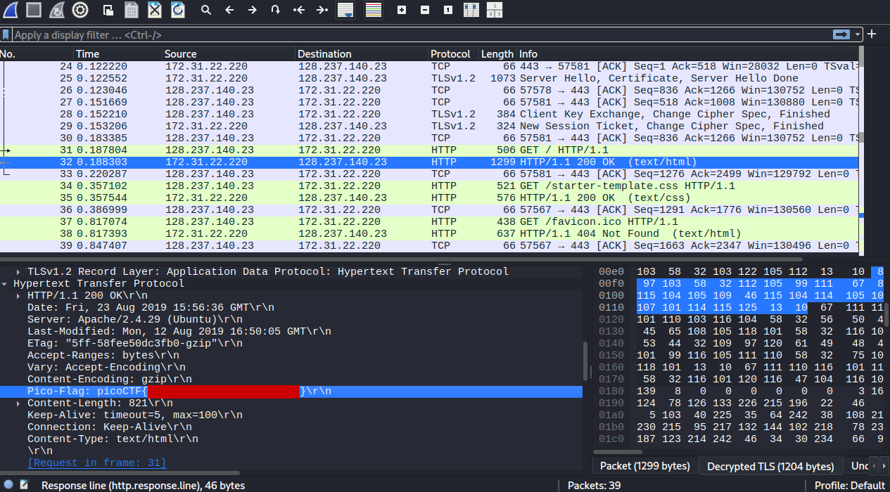

<!--
---
slug: "picoctf-WebNet0"
title: "picoCTF — WebNet0"
date: "2026-08-25"
ctf: "picoCTF"
challenge: "WebNet0"
difficulty: "beginner"
tags: ["wireshark"]
tools: ["Wireshark"]
summary: "Using Wireshark to find a flag in encrypted TLS traffic"
---
-->

# picoCTF — WebNet0

## Overview

| Field | Detail |
|-------|--------|
| CTF | picoCTF |
| Category | Forensics |
| Tools | Wireshark |

---

## Loading the Private Key

This challenge provided both a packet capture file and a private key file. Hence, to start this challenge, I imported the private key into Wireshark using `Edit` -> `Preferences` -> `Protocols` -> `TLS` -> `RSA keys list`. I found the client IP address and port by finding the sender of the `Client Hello` packet.

## Finding the Flag

After applying these changes, the `TLS Application Data` packets were automatically decrypted into HTTP communications. I started my investigation by searching these decrypted packets. These communications consisted of the client loading a HTML website. When searching through the server's response to the GET request for the website, I found a field in the HTTP metadata labeled `Pico-Flag` with the flag as its value.

---

## What I learned

- **Importing private keys into Wireshark to decrypt communication** This was my first time importing private keys into Wireshark to decrypt encrypted communication. This is very practical for real world work as the vast majority of communication over the internet is encrypted.

---

## References
- [picoCTF - WebNet0](https://learn.cylabacademy.org/library/32)