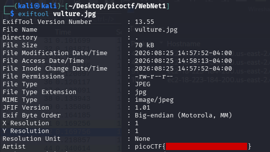

<!--
---
slug: "picoctf-WebNet1"
title: "picoCTF — WebNet1"
date: "2026-08-25"
ctf: "picoCTF"
challenge: "WebNet1"
difficulty: "beginner"
tags: ["wireshark"]
tools: ["Wireshark"]
summary: "Decrypting TLS traffic and extracting a flag hidden in image file metadata"
---
-->

# picoCTF — WebNet1

## Overview

| Field | Detail |
|-------|--------|
| CTF | picoCTF |
| Category | Forensics |
| Tools | Wireshark |

---

## Loading the Private Key

Similar to the previous challenge, this challenge provided both a packet capture file and a private key file. Hence, to start this challenge, I imported the private key into Wireshark using `Edit` -> `Preferences` -> `Protocols` -> `TLS` -> `RSA keys list`. I found the client IP address and port by finding the sender of the `Client Hello` packet.

## Finding the Flag

After applying these changes, the `TLS Application Data` packets were automatically decrypted into HTTP communications. These communications consisted of the client loading an HTML website and an image. The `Pico-Flag` field in the HTTP metadata from the previous challenge remained, however this time it had the value `picoCTF{this.is.not.your.flag.anymore}` meaning the flag was elsewhere. 

From here, I exported the loaded image file using `File` -> `Export Objects` -> `HTTP` and selected the image file. I then ran `exiftool` on the image file to extract the file metadata and found the flag stored in the `Artist` field.

---

## What I learned

- **Exporting files from Wireshark packet capture** This was my first time exporting a file from a Wireshark packet capture.

---

## References
- [picoCTF - WebNet1](https://learn.cylabacademy.org/library/42)