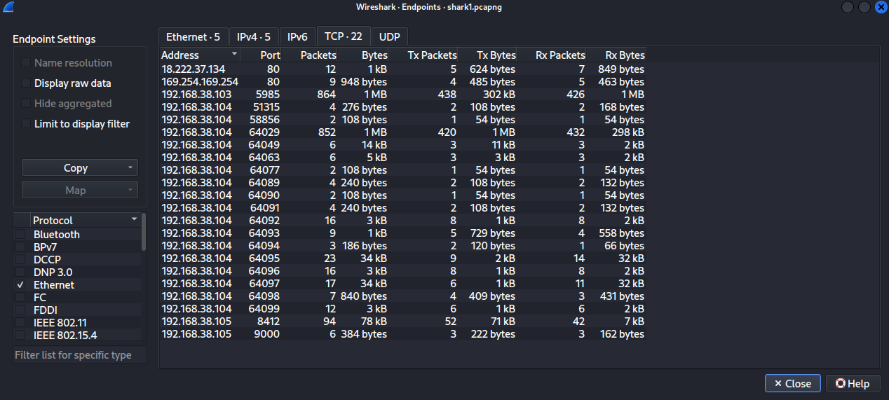
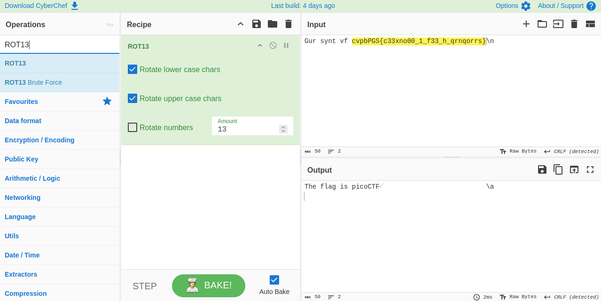

<!--
---
slug: "picoctf-wireshark-doo-dooo-do-doo"
title: "picoCTF — Wireshark doo dooo do doo"
date: "2026-08-23"
ctf: "picoCTF"
challenge: "Wireshark doo dooo do doo"
difficulty: "beginner"
tags: ["wireshark"]
tools: ["Wireshark"]
summary: "Finding the flag in a packet capture using Wireshark."
---
-->

# picoCTF — Wireshark doo dooo do doo

## Overview

| Field | Detail |
|-------|--------|
| CTF | picoCTF |
| Category | Forensics |
| Tools | Wireshark |

---

## Finding suspicious behaviour

I started this challenge by looking at the endpoints communicating in the packet capture using `Statistics` -> `Endpoints`.

In this page, I found that the majority of the communication came from endpoints with a `192.168.38.*` IP address, however there were two other IP addresses identified in the packet capture: `18.222.37.134` and `169.254.169.254`. These became the first entrypoints to my investigation.

Using display filters to show only communication with these two IP addresses, I found that a single HTTP GET request was sent to each. The `169.254.169.254` IP address responded with "none" in packet 964 while the `18.222.37.134` IP address responded with "Gur synt vf cvpbPGS{c33xno00_1_f33_h_qrnqorrs}\n" in packet 827. This response seems to follow the same format as the "picoCTF{...}" flag format with encrypted text.

Investigating the communication around packet 827, I found packets 816 and 817 to be an ARP request and response. `192.168.38.1` broadcast an ARP request asking which device on the local network owned the IP `192.168.38.104`, and received a reply claiming to map that IP to a MAC address. However, immediately following this exchange, `192.168.38.1` began communicating not with `192.168.38.104` as expected, but with the external IP `18.222.37.134`, which is what led to the HTTP response containing the flag.

This is consistent with an **ARP spoofing attack**. ARP has no authentication, so any device on the local network can send a forged ARP reply claiming to own an IP address it doesn't actually own. If a malicious device responded to the ARP request before the legitimate `192.168.38.104` could, `192.168.38.1` would cache the wrong MAC address and unknowingly send its traffic to the attacker instead. The attacker, now positioned in the middle, could then forward or handle the traffic however they chose. In this case, the HTTP GET request ultimately reached `18.222.37.134`, suggesting the attacker was proxying traffic out to an external server.

---

## Decrypting the flag

As mentioned, this encrypted message seemed to follow the format of the picoCTF flag, with the correct casing and location of curly braces. This caused me to first suspect it was encrypted using a shift cipher like a Caesar Cipher. To determine the shift, I counted the distance from p -> c and found it to be 13. I then verified this by counting the distance from i -> v which was also 13. The ROT13 cipher is a specific variation of the Caesar Cipher with a shift of 13. I decrypted the message in CyberChef with the ROT13 Cipher and found the flag.

---

## What I learned

- **Methods for identifying suspicious network traffic with Wireshark** This was my first Wireshark CTF challenge with no hints or clues as to where to look for the suspicious traffic. Hence, I learned how to use the `statistics` page to identify suspicious traffic.
- **ARP Spoofing Attacks** This was my first time learning about how a malicious computer on a network can trick other computers on the network into communicating with them by falsely responding to an ARP request.

---

## References
- [picoCTF - Wireshark doo dooo do doo](https://learn.cylabacademy.org/library/115)