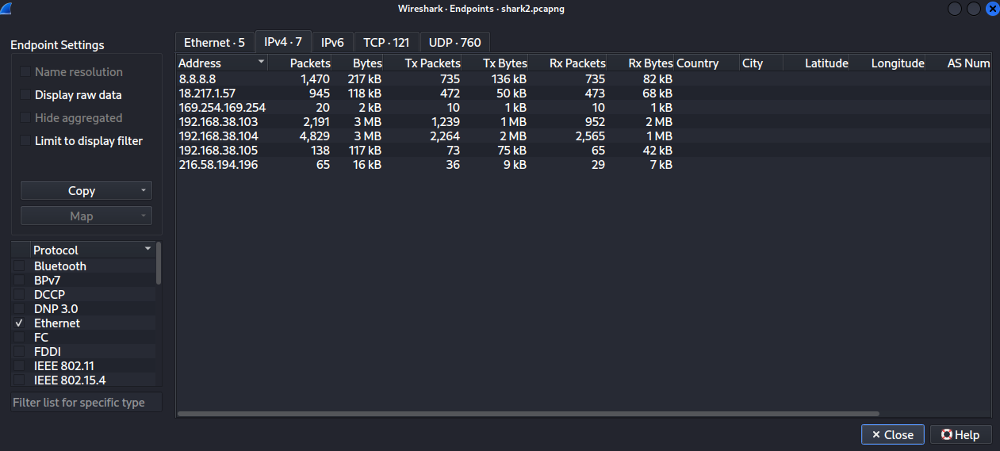
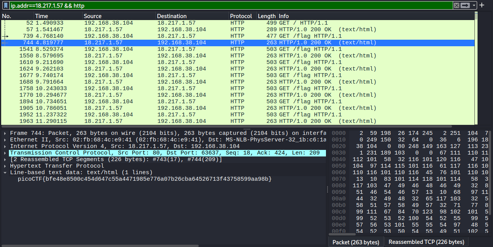
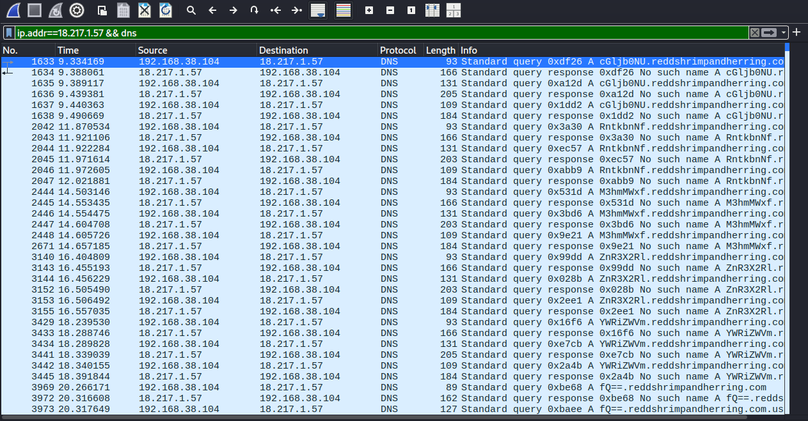
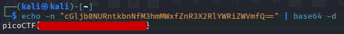

<!--
---
slug: "picoctf-wireshark-twoo-twooo-two-twoo"
title: "picoCTF — Wireshark twoo twooo two twoo"
date: "2026-08-24"
ctf: "picoCTF"
challenge: "Wireshark twoo twooo two twoo"
difficulty: "beginner"
tags: ["wireshark"]
tools: ["Wireshark"]
summary: "Identifying DNS exfiltration in a packet capture to extract a base64-encoded flag"
---
-->

# picoCTF — Wireshark twoo twooo two twoo

## Overview

| Field | Detail |
|-------|--------|
| CTF | picoCTF |
| Category | Networking |
| Tools | Wireshark |

---

## Finding suspicious traffic

Similarly to the first challenge in this series, I started searching for suspicious traffic by viewing the endpoints in `Statistics` -> `Endpoints`. 

This showed that there were three IP addresses from outside the local network: `18.217.1.57`, `169.254.169.254`, `216.58.194.196` (along with the DNS server of `8.8.8.8`). Hence, I started my investigation with these.

Right off the bat, I found almost a hundred HTTP GET requests to `18.217.1.57` for `/flag` with each returning a unique flag in the correct picoCTF{...} format.

However, before attempting to decrypt these, one by one, I found a separate HTTP request to the same server with a response in packet 57 stating "The official Red's Shrimp and Herring website is still under construction. Please check back later!" making me believe these `/flag` responses were a red herring as it implies so in the website's name.

Before moving on to investigating the other outside servers, I found more interesting traffic to the `18.217.1.57` server in the form of DNS queries. Throughout the packet capture, there are many queries from the host machine to the `8.8.8.8` DNS server for `redshrimpandherring.com` with a variety of subdomains, however, when setting a display filter to `ip.addr==18.217.1.57` I found that there were a few DNS queries from the host machine to `18.217.1.57` for this same domain with unique subdomains. Furthermore, when setting a display filter to `ip.addr==18.217.1.57 && dns` I found that the subdomain of the last query was `fQ==` causing me to believe the subdomains, when put together, formed a base64 string. 

Hence, I combined the subdomains in the DNS queries to `18.217.1.57` and decoded in base64, which produced the flag.

---

## What I learned

- **DNS Exfiltration as a data smuggling technique** This challenge showed me directly an example of DNS exfiltration. DNS traffic is rarely inspected because it's considered infrastructure-level communication, making it an effective covert channel for smuggling data out of a network.

---

## References
- [picoCTF - Wireshark twoo twooo two twoo](https://learn.cylabacademy.org/library/110)